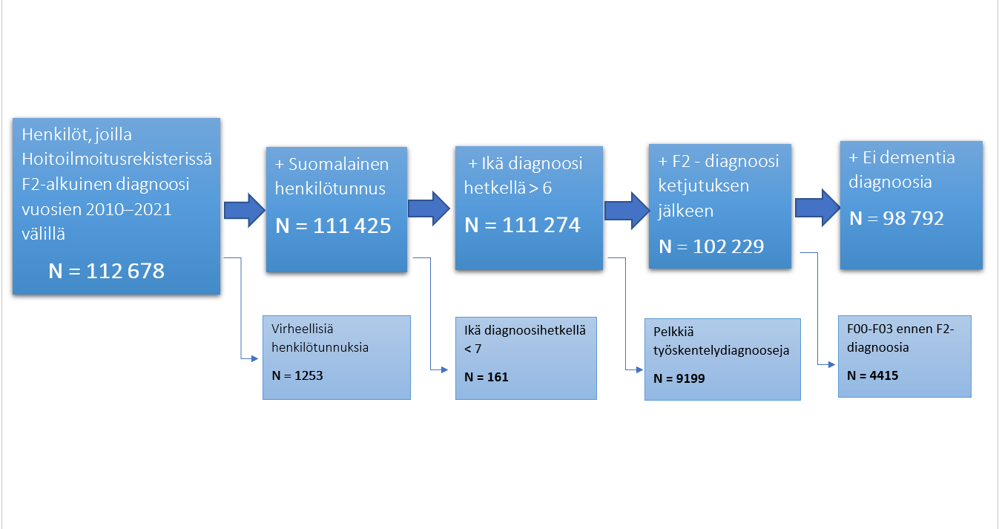

```{r, include=FALSE}
knitr::opts_chunk$set(echo = FALSE, eval = TRUE, fig.retina = 4)
library(here)
library(data.table)
library(ggplot2)
library(ggtext)
library(epitools)
library(gganimate)
library(stringr)
library(patchwork)
#library(plotly)
library(DT)
library(scales)

```


```{r}
# read data

dat <- list()
dat$psyk <- fread(here('data', 'psyk.csv'), encoding = 'UTF-8')
dat$dg_2_krt <- fread(here('data', 'psyk_2.csv'), encoding = 'UTF-8')

dat$hoidonjatko <- fread(here('data', 'hoidonjatko.csv'), encoding = 'UTF-8')

dat$laakitys_in <- fread(here('data', 'laake_hoito.csv'), encoding = 'UTF-8')


```

```{r, include=FALSE}
# datan valmistelu

# psyk datan valmistelut, kuvien asetukset, labelit
source(here("R", "01_general_settings.R"), local = knitr::knit_global(), encoding = 'UTF-8')


source(here("R", "02_prepare_psyk_data_for_figs.R"), local = knitr::knit_global(), encoding = 'UTF-8')


# hoidonjatko valmistelu
source(here("R", "02_prepare_hoidonjatko.R"), local = knitr::knit_global(), encoding = 'UTF-8')

# gis valmistelu
source(here("R", "02_prepare_gis.R"), local = knitr::knit_global(), encoding = 'UTF-8')

# laakitys valmistelu
source(here("R", "02_prepare_laakitys.R"), local = knitr::knit_global(), encoding = 'UTF-8')


# KARTTA-Functiot --

# dg_kartat
source(here("R", "03_figs_dgs_maps_fun.R"), local = knitr::knit_global(), encoding = 'UTF-8')

# hoidonjatko kartat
source(here("R", "03_figs_hoidonjatko_maps_fun.R"), local = knitr::knit_global(), encoding = 'UTF-8')

# laakitys kartat
source(here("R", "03_figs_laakitys_maps_fun.R"), local = knitr::knit_global(), encoding = 'UTF-8')


# kartta-funtioissa ensin yhdistetaan datan ja sitten piirretaan. Vaikeutena, että GIS-data ei toimi data.tablessa kunnolla, siksi tietomuodot menevat vahan sekaisin.
#

```

# Yleistä

## Rekisterin muodostaminen

- Rekisteriä varten poimittiin henkilöt, joilta löytyy edes kerran sisäänottokriteerin mukainen diagnoosi F20-F29 (tai ICPC2: P72 tai P98) vuodesta 2010 alkaen Hoitoilmoitusrekisteristä (TerveysHilmo tai AvoHilmo).
- Henkilön ensimmäinen diagnoosi on kuitenkin voinut olla jo aiemmin.
- Lisärajaukset seuraavalla dialla.

### Tarkastelualueiden määrittely
- Sairaanhoitopiirialue määritellään henkilön kotikunnan mukaisesti
- Sairaanhoitopiireissä on poikkeuksellisesti eritelty Helsinki ja HUS ilman Helsinkiä, koska molemmat yksistään ovat västöltään suurempia kuin sitä seuraava sairaanhoitopiiri (PSHP)

### Lähtökohtana katsoa, mitä kaikkea olemassa olevista tietolähteistä saa irti


# Hilmo-datan esiprosessointi pienensi rekisterissä olevien henkilöiden määrää 

```{r fifRajaukset, out.width="80%", fig.cap='Kuva: Hilmo-datan rajaukset'}

```


# Diagnoosien jakauma (hierarkinen)  {.tabset}

```{r}
#diagnoosien osuudet


fig_dg_1 <- function(dat_in, nudge_y = 5, ylim_max = 66){
  ggplot(dat_in, aes(y=pros,x=dg, fill=dg))+
    geom_bar(stat='identity')+ 
    geom_text(aes(label=paste0(n_decim(n,0), ' (', round(pros, digits = 1), '%)')), nudge_y = nudge_y)+
    scale_fill_manual(values=palettes$color_thl)+
    theme_classic()+
    theme(legend.position = "none",
          panel.grid.major.x = element_line( size=.1, color="gray" ),
          panel.grid.minor.x = element_line( size=.1, color="gray90" ),
          text = element_text(size = text_size))+
    scale_y_continuous(minor_breaks = seq(0 , 100, 5), breaks = seq(0, 100,10 ), limits = c(0,ylim_max))+
    scale_x_discrete(limits = rev)+
    ylab('Prosenttia')+
    coord_flip()
}

```

## Diagnoosi vähintään kerran (N = `r n_1_krt %>% n_decim(0)`)
```{r  dgJakauma1, fig.height=5}
fig_dg_1(dat_figs$diagnoosien_jakauma$dg_1_krt, nudge_y = 7, ylim_max = 57)

```

Kuva 1: `r paste(labs_lst$tilanne, labs_lst$suomi, sep=' ')`

## Diagnoosi vähintään 2 kertaa (N = `r n_2_krt %>% n_decim(0)` [`r (100* n_2_krt / n_1_krt) %>% n_decim(1)`%])

```{r dgJakauma2, fig.height=5}
 fig_dg_1(dat_figs$diagnoosien_jakauma$dg_2_krt, nudge_y = 7, ylim_max = 57)

```

Kuva 2: `r paste(labs_lst$tilanne, labs_lst$suomi, sep=' ')`

`r diagnoosit_cap`


# Prevalenssi 31.12.`r latest_y$psyk` {.tabset}

## Kartta
```{r,  fig.show="hold", out.height='520px'}
draw_prevalence_alue_total()
```

## Taulukko

```{r}
merge(
  dat$latest_y[, .(n = sum(N)), by = shp],
  dat_figs$prevalence_alue[, lapply(.SD, round, digits = 1), .SDcols = 2:5, by = shp],
  by = 'shp'
  ) %>% 
  datatable()
```
Rates per `r rate_per` persons


## Tietoa indikaattoriesta

Lorem Ipsum is simply dummy text of the printing and typesetting industry. Lorem Ipsum has been the industry's standard dummy text ever since the 1500s, when an unknown printer took a galley of type and scrambled it to make a type specimen book. It has survived not only five centuries, but also the leap into electronic typesetting, remaining essentially unchanged. It was popularised in the 1960s with the release of Letraset sheets containing Lorem Ipsum passages, and more recently with desktop publishing software like Aldus PageMaker including versions of Lorem Ipsum.


# Hoidonjatko `r latest_y$hoidonjatko +1` PTH + ESH käynnit  {.tabset}

## Kartta

vasemmalla 1, oikealla 4 viikkoa

```{r,  fig.show="hold", out.width="50%", out.height='520px'}
draw_hoidonjatko(hoitomuoto_in = "PTH + ESH avohoito (käynnit)", jakso_in = "1 viikko")
draw_hoidonjatko(hoitomuoto_in = "PTH + ESH avohoito (käynnit)", jakso_in = "4 viikkoa")
```


## Taulukko

```{r}
  dat$hoidonjatko[HOITOMUOTO == "PTH + ESH avohoito (käynnit)" &  JAKSO == '1 viikko', .SD, .SDcols = 2:8] %>% 
  datatable()

```

## Tietoa indikaattoriesta

Lorem Ipsum is simply dummy text of the printing and typesetting industry. Lorem Ipsum has been the industry's standard dummy text ever since the 1500s, when an unknown printer took a galley of type and scrambled it to make a type specimen book. It has survived not only five centuries, but also the leap into electronic typesetting, remaining essentially unchanged. It was popularised in the 1960s with the release of Letraset sheets containing Lorem Ipsum passages, and more recently with desktop publishing software like Aldus PageMaker including versions of Lorem Ipsum.


# Ongelma tässä

on vaan se, että aluieta on 22, hoidonjatkossa hoitomuotoja on 11 ja tarkastelua-aikoja on 1, 2, 4, 12, 52 vko

## Karttoja ja taulukkoja tulee kumpiakin 22 * 11* 5 =  `r 22*11*5`

Interkatiivisuus olisi helppo ratkaisu tähän, mutta ei tietenkään mikään itsetarkoitus.

Tämän sivun kaltaiset R-raportit ovat helppoja tehdä ja ovat teknistä raportointia parhaimmillaan, mutta eivät kovin paljoa vie itse asiaa eteenpäin.

<br><br>
